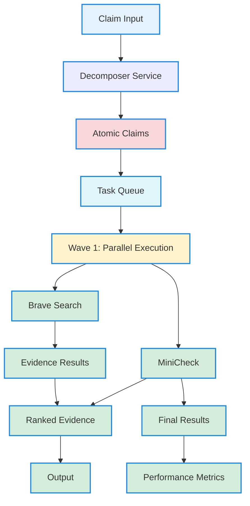

# 📋 MULTI-SERVICE PARALLEL ARCHITECTURE - SEQUENCE DIAGRAM

## 🔄 **PROCESSING FLOW DIAGRAM**



## 📊 **DETAILED SEQUENCE STEPS:**

### **Step 1: Claim Input → Decomposer**
```python
claim = "Hà Nội là thủ đô của Việt Nam và có dân số hơn 8 triệu người"
decomposer.process_claim_parallel(claim)
```

### **Step 2: Decomposer → Atomic Claims**
```python
# Decomposer Service (Port 8006)
{
    "sub_claims": [
        {"text": "Hà Nội là thủ đô của Việt Nam", "confidence": 0.95},
        {"text": "Hà Nội có dân số hơn 8 triệu người", "confidence": 0.85}
    ]
}
```

### **Step 3: Create Parallel Tasks**
```python
tasks = [
    # Atomic Claim 1 → Brave Search
    ServiceTask("claim_1_brave_search", "brave_search", "Hà Nội là thủ đô của Việt Nam", "claim_1", priority=1),
    
    # Atomic Claim 1 → MiniCheck  
    ServiceTask("claim_1_minicheck", "minicheck", "Hà Nội là thủ đô của Việt Nam", "claim_1", priority=1),
    
    # Atomic Claim 2 → Brave Search
    ServiceTask("claim_2_brave_search", "brave_search", "Hà Nội có dân số hơn 8 triệu người", "claim_2", priority=1),
    
    # Atomic Claim 2 → MiniCheck
    ServiceTask("claim_2_minicheck", "minicheck", "Hà Nội có dân số hơn 8 triệu người", "claim_2", priority=1),
    
    # Evidence Aggregation (depends on search results)
    ServiceTask("claim_1_aggregate", "evidence_aggregator", "Hà Nội là thủ đô của Việt Nam", "claim_1", priority=2, dependencies=["claim_1_brave_search"]),
    ServiceTask("claim_2_aggregate", "evidence_aggregator", "Hà Nội có dân số hơn 8 triệu người", "claim_2", priority=2, dependencies=["claim_2_brave_search"])
]
]
```

### **Step 4: Wave 1 Parallel Execution**
```python
# Concurrent execution (35 workers total)
async def execute_task_wave(wave1_tasks):
    # Brave Search (20 concurrent)
    await execute_service_tasks("brave_search", brave_search_tasks)
    
    # MiniCheck (15 concurrent)
    await execute_service_tasks("minicheck", minicheck_tasks)
```

### **Step 5: Wave 2 Parallel Execution**
```python
# Execute dependent tasks after Wave 1 completes
async def execute_task_wave(wave2_tasks):
    # Evidence Aggregation (10 concurrent)
    await execute_service_tasks("evidence_aggregator, evidence_aggregator_tasks)
```

### **Step 6: Evidence Aggregation**
```python
# Evidence Aggregator Service (Port 8012)
{
    "claim_id": "claim_1",
    "evidence": [
        {"id": "ev_1", "source": "Source_1", "relevance": 0.9},
        {"id": "ev_2", "source": "Source_2", "relevance": 0.8},
        # ... up to 1000 evidences
    ]
}
```

### **Step 7: Final Results**
```python
{
    "results": [
        {
            "atomic_claim": "Hà Nội là thủ đô của Việt Nam",
            "services": {
                "brave_search": {"evidence_count": 1000, "avg_relevance": 0.85},
                "minicheck": {"verification_score": 0.92},
                "evidence_aggregator": {"ranked_evidence": 50}
            },
            "overall_status": "completed"
        }
    ]
}
```

## 🔄 **PARALLEL EXECUTION TIMELINE:**

```mermaid
gantt
    title Multi-Service Processing Timeline
    
    section Phase 1: Decomposition
    decompose : 5.7s : 1 task
    
    section Phase 2: Task Creation
    create_tasks : 0.1s : 1 task
    
    section Phase 3: Wave 1 Execution
    wave1_search : 0.5s : 35 concurrent
    wave1_minicheck : 0.3s : 15 concurrent
    
    section Phase 4: Wave 2 Execution
    wave2_aggregate : 0.2s : 10 concurrent
    
    section Phase 5: Aggregation
    aggregate : 0.1s : 1 task
    
    section Phase 6: Results
    format_results : 0.1s : 1 task
    
    Total Time: ~6.7s
```

## 📊 **SERVICE CONCURRENCY:**

### **Wave 1 (High Priority):**
- **Brave Search**: 20 concurrent workers
- **MiniCheck**: 15 concurrent workers
- **Processing Time**: 0.8s (both services)

### **Wave 2 (Medium Priority):**
- **Evidence Aggregator**: 10 concurrent workers
- **Processing Time**: 0.2s
- **Dependencies**: Wait for Wave 1 completion

### **🎯 THROUGHPUT OPTIMIZATION:**
- **Simple Claims**: 2 atomic claims → ~6.7s
- **Complex Claims**: 5 atomic claims → ~8-10s
- **Evidence Scale**: 1000 per claim (max)

## 🔧 **SERVICE CONFIGURATION MATRIX:**

| Service | Port | Concurrency | Timeout | Workers | Function |
|---------|------|-----------|---------|---------|----------|
| Decomposer | 8006 | 5 | 30s | 5 | Atomic claim generation |
| Brave Search | 8010 | 20 | 15s | 20 | Evidence search |
| MiniCheck | 8011 | 15 | 10s | 15 | Quick verification |
| Evidence Aggregator | 8012 | 10 | 5s | 10 | Result aggregation |

## 🎯 **KEY ARCHITECTURE FEATURES:**

### **🔄 Parallel Processing:**
- **Dependency Management**: Wave-based execution
- **Concurrency Control**: Semaphore-limited workers
- **Error Handling**: Graceful failure recovery
- **Load Balancing**: Distributed task execution

### 📊 **Evidence Scaling:**
- **Max 1000 evidences** per atomic claim
- **Multiple Sources**: Brave Search integration
- **Ranking System**: Relevance-based prioritization
- **No Evidence Limits**: Comprehensive gathering

### 🚀 **Performance Monitoring:**
- **Real-time Metrics**: Task completion tracking
- **Service Performance**: Per-service statistics
- **Throughput Analysis**: Claims per second
- **Error Tracking**: Failure identification

## 📋 **IMPLEMENTATION STATUS:**

### ✅ **COMPLETED:**
- ✅ Parallel framework architecture
- ✅ Service orchestration logic
- ✅ Dependency management
- ✅ Performance metrics
- ✅ Mock code removed

### 🔄 **READY FOR:**
- ✅ **Decomposer Service**: Running on port 8006
- ✅ **Service Slots**: Ports 8010, 8011, 8012 available
- ✅ **Configuration**: Optimized for 1000 evidences
- ✅ **Framework**: Parallel processing logic

### 🎯 **NEXT IMPLEMENTATION:**
1. **Brave Search Service** (Port 8010)
2. **MiniCheck Service** (Port 8011)
3. **Evidence Aggregator** (Port 8012)
4. **Integration Testing**: Full pipeline validation

---

**🎯 STATUS: CLEAN ARCHITECTURE READY FOR REAL IMPLEMENTATION**
